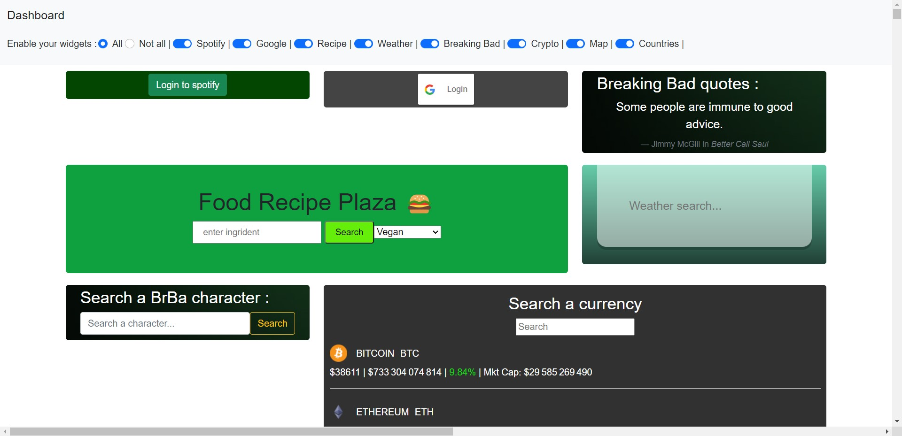
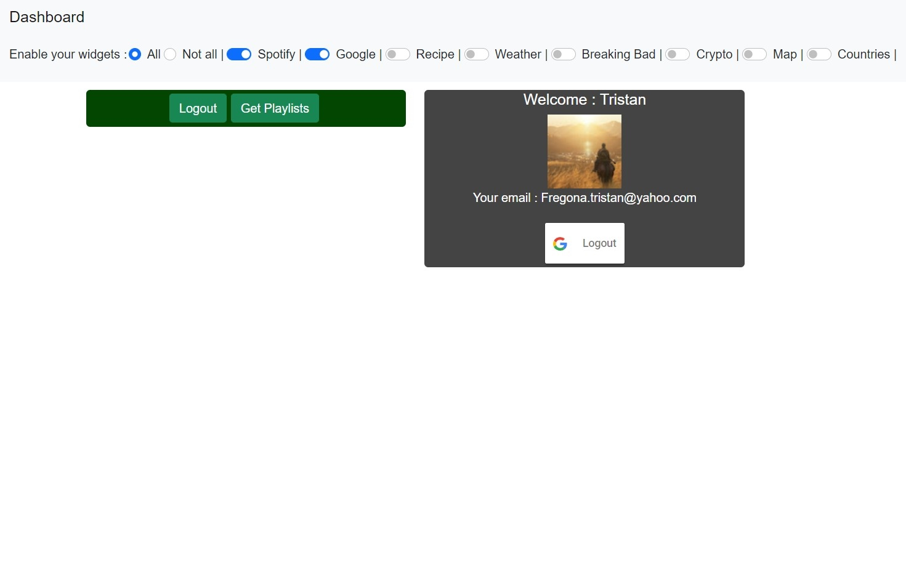
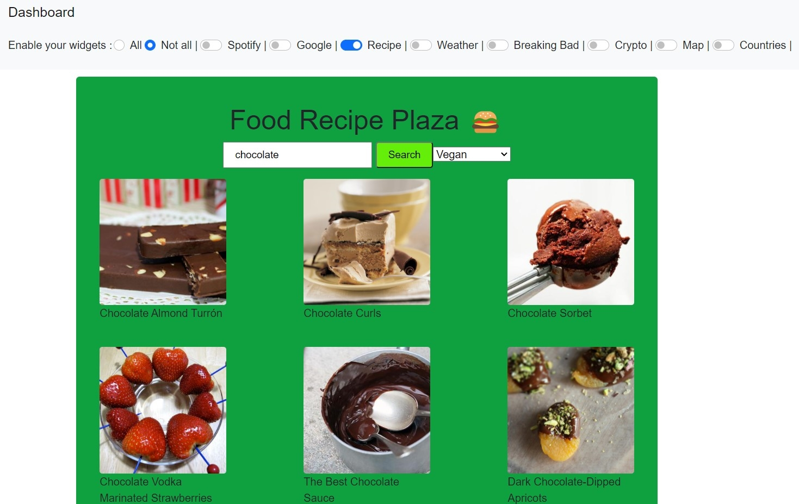
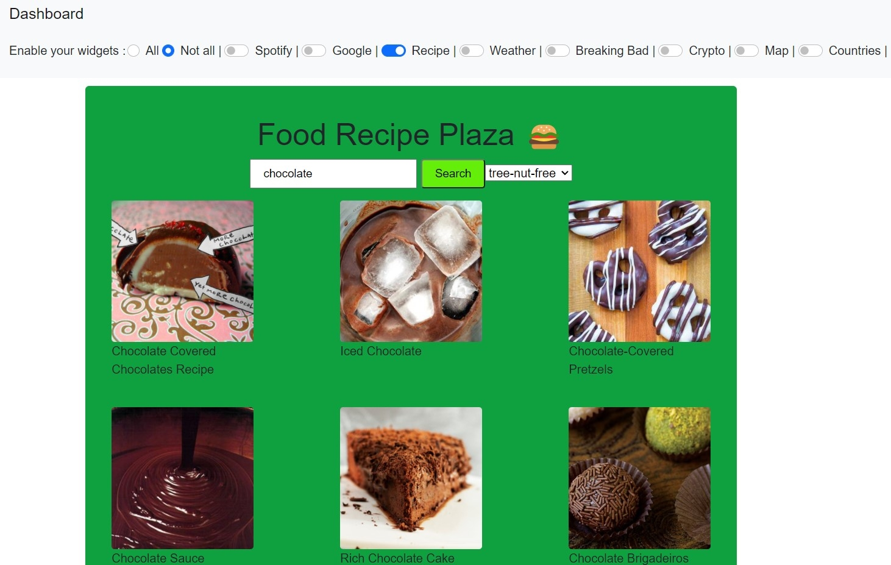
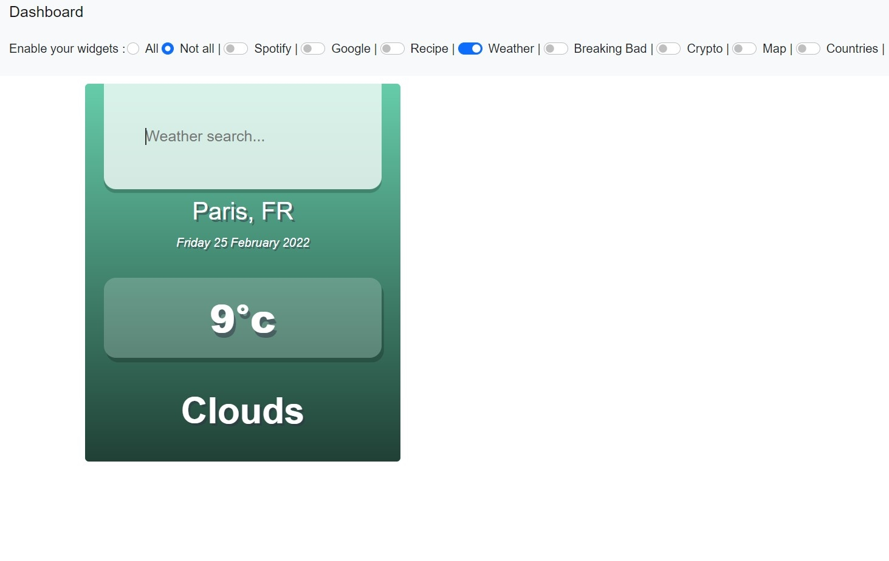
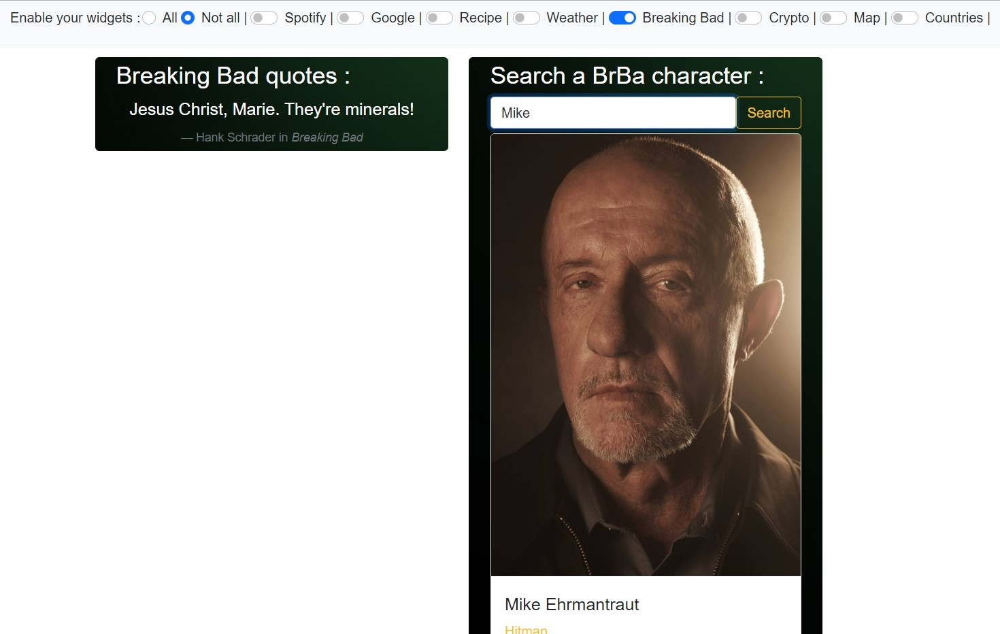
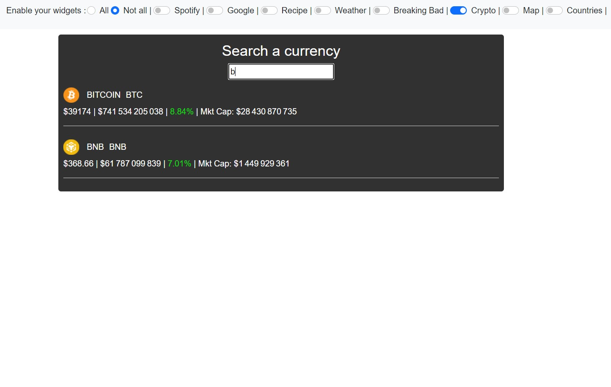
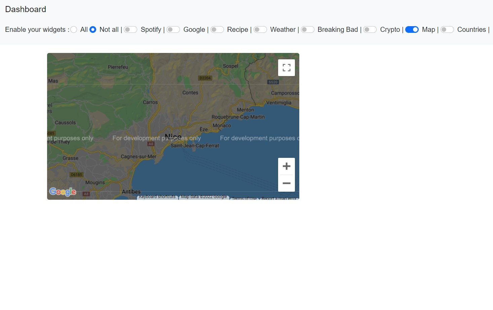
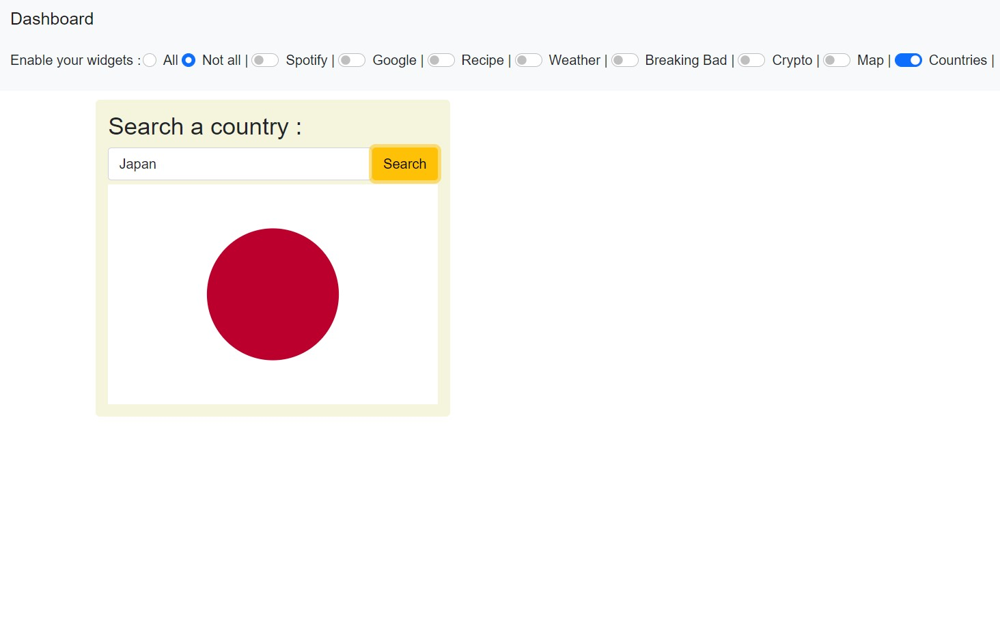

# Post_It

## Project setup
```
npm install
```

### Run the web app 
```
npm run start
```
## Web App Preview

### Home page

Display all the widgets with a navbar where choosing particular widgets

<p align="center">
  
</p>

### Application logs

Login to google to see your informations (using a cookie)
Login to spotify to see your playlists (using local storage)

<p align="center">
  
</p>

### Recipe widget

Search recipes by ingredients with an option (vegan, sugar free, etc ...)

<p align="center">
  
</p>

<p align="center">
  
</p>

### Weather widget

Search the weather in your city

<p align="center">
  
</p>

### Breaking Bad widgets

Random quotes for each refresh and a search bar to find characters of the famous tv-show

<p align="center">
  
</p>

### Cryptocurrency

Find the cryptocurrency you want to monitor

<p align="center">
  
</p>

### Google map widget

Search a place with the most popular API map

<p align="center">
  
</p>

### Flag widget

Find the flag for the country you want

<p align="center">
  
</p>